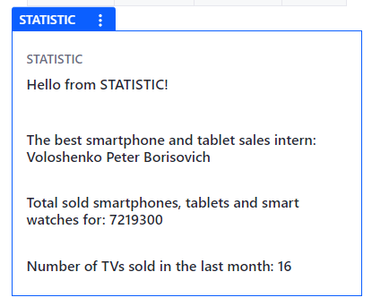
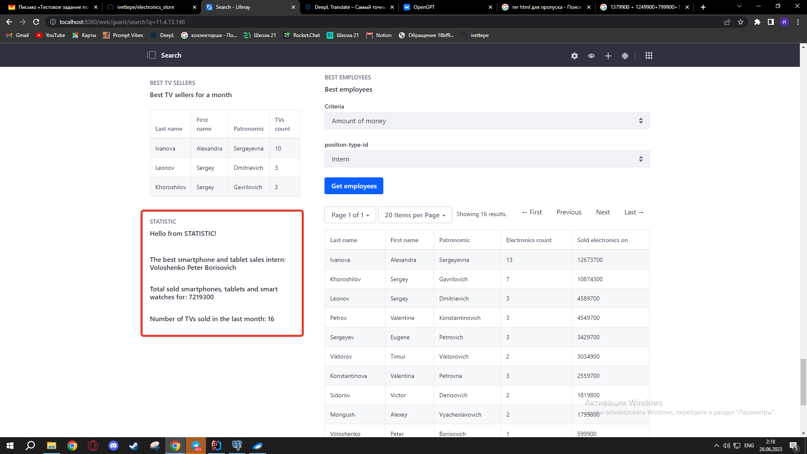

# Тестовое задание от компании "Информационные системы и сервисы" на вакансию Java разработчик

Инструкция по запуску через blade располагается в файле **GETTING_STARTED.markdown**

Для запуска в Intellij IDEA необходимо установить расширение Liferay, после чего нажать правой кнопкой мыши на корневую папку и выбрать InitBundle, после чего сгенерируется и подгрузится папка bundles со всем необходимым для запуска. При необходимости сменить базу данных можно внести изменения в файл portal-ext.properties, находящимся в папке bundels или стереть все из файла portal-setup-wizard.properties, в той же папке, добавив в запись setup.wizard.enabled=true (в таком случае откроется меню первоначальной настройки сайта на liferay (ввод данных администратора, выбор базы данных и тд)).

Архив с csv файлами на английском языке для модуля zip-handling лежит в папке archive

## Модули и директории
- В директории **archive** хранит в себе файл example.zip, в котором хранятся .csv файлы, приложенные к заданию, но переведенные мною на английскй язык, для избегания проблем с различными кодировками.
- **configs** хранит в себе папки с файлами, в которых записаны использованные мною данные из **portal-setup-wizard.properties** и **portal-ext.properties**.
- **service-builder** - модуль Liferay типа service-builder. Хранит в себе модели, сервисы и другие файлы и классы, необходимые для взаимодействия с базой данных.
- **zip-handling-module** - модуль Liferay типа mvc-portlet для распаковки архива и перенесение информации из **csv** файлов в соответсвующие таблицы.
- **web-module** - модуль Liferay типа mvc-portlet, который отвечает за отображение таблиц (основных реестров и справочников) на сервере и за взаимодействие с ними.
- **best-employees-module** - модуль Liferay типа mvc-portlet, который отвечает за отображение статистики по сотрудникам
- **statistic** - модуль Liferay типа mvc-portlet, который отвечает за вывод лучшего стажера по продаже смартфонов и планшетов, вывод суммы денежных средств,
полученной магазином от продажи смартфонов, планшетов и умных часов, вывод количества проданных тв за последний месяц.

## Видео обзор
Видео обзор на веб приложение можно посмотреть по ссылке:
https://drive.google.com/file/d/1Gw3DLZzKuepeTKSWB0mvfOwJOpNIpmkR/view?usp=sharing

(если видео не загружается - разрешите cockie на странице)

### Дополнительно к текстовому документу в сообщении было задание:
В рамках задания необходимо выполнить:
1. вывод лучшего стажера по продаже смартфонов и планшетов;
2. вывод суммы денежных средств, полученной магазином от продажи смартфонов, планшетов и умных часов;
3. вывод количества проданных тв за последний месяц.

- В видео обзоре решения задания не коснулся этих пунктов, но задание мною выполнено. Прикладываю скриншоты данного модуля:

